# Classical Chess Bot Algorithms

## 1. Overall decision pipeline

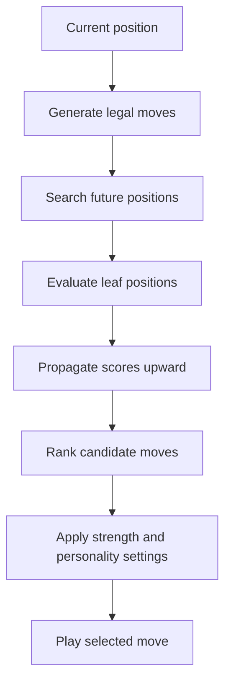

The bot needs two major components:

1. A search algorithm that looks ahead.
2. An evaluation function that estimates who is winning.

---

# 2. Game-tree search

A chess position becomes the root of a tree. Each legal move creates a child position.

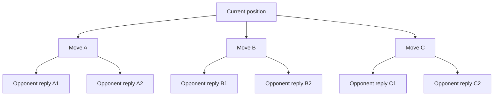

One level is called a **ply**:

- Depth 1: bot makes one move.
- Depth 2: bot move + opponent reply.
- Depth 3: bot move + opponent reply + bot continuation.

If a position has approximately \(b\) legal moves and you search \(d\) plies:

$$
\text{positions searched} \approx b^d
$$

With approximately 30 moves per position:

$$
30^4 = 810{,}000
$$

$$
30^6 = 729{,}000{,}000
$$

This exponential growth is why pruning is essential.

---

# 3. Minimax

Minimax assumes:

- The bot chooses the highest score.
- The opponent chooses the lowest score.
- Both sides play their strongest available move.

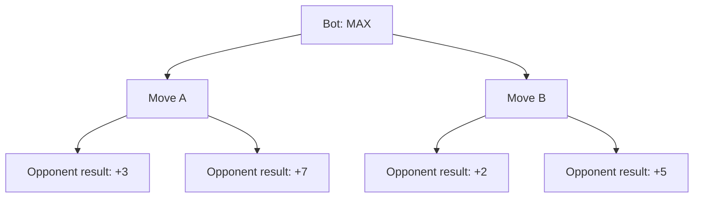

The opponent minimizes:

$$
A = \min(3,7)=3
$$

$$
B = \min(2,5)=2
$$

The bot maximizes:

$$
\max(A,B)=\max(3,2)=3
$$

Therefore, the bot selects Move A.

## Minimax definition

$$
V(s)=
\begin{cases}
\operatorname{Evaluate}(s), & \text{if search ends}\\
\max V(\operatorname{child}(s)), & \text{bot's turn}\\
\min V(\operatorname{child}(s)), & \text{opponent's turn}
\end{cases}
$$

---

# 4. Negamax

Chess is a zero-sum game:

$$
\text{my advantage}=-\text{opponent's advantage}
$$

Negamax uses this symmetry to replace separate minimizing and maximizing functions:

$$
N(s,d)=\max_{m\in Moves(s)}
\left[-N(\operatorname{make}(s,m),d-1)\right]
$$

Simplified Go-like pseudocode:

```go
func negamax(position Position, depth int) int {
    if depth == 0 {
        return evaluate(position)
    }

    best := NegativeInfinity

    for _, move := range position.LegalMoves() {
        position.Make(move)

        score := -negamax(position, depth-1)

        position.Unmake(move)

        if score > best {
            best = score
        }
    }

    return best
}
```

The returned score is always from the current side’s perspective.

---

# 5. Alpha–beta pruning

Alpha–beta pruning avoids searching branches that cannot change the final answer.

- \(\alpha\): best score the current side can already guarantee.
- \(\beta\): highest score the opponent will allow.
- Prune when:

$$
\alpha \geq \beta
$$

Example:

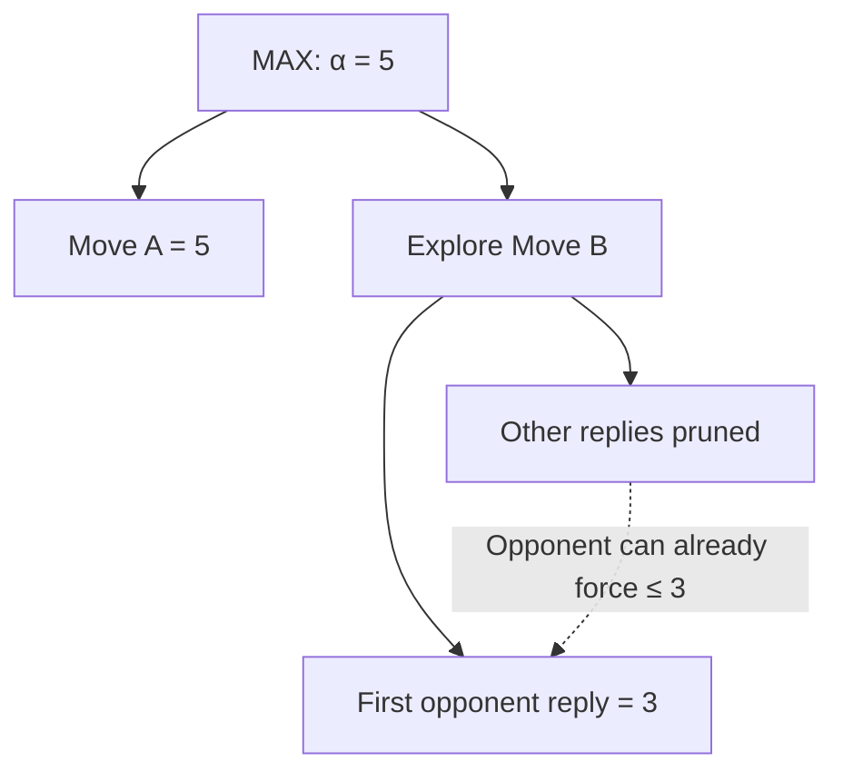

The bot already has Move A scoring 5. While examining Move B, it discovers that the opponent can force the score down to 3.

Because MAX will never choose 3 instead of 5, the remaining replies under Move B cannot affect the decision.

## Complexity

Without pruning:

$$
O(b^d)
$$

With ideal move ordering:

$$
O(b^{d/2})
$$

For \(b=30\) and \(d=6\):

$$
30^6=729{,}000{,}000
$$

Ideal alpha–beta behavior approaches:

$$
30^3=27{,}000
$$

Actual performance depends heavily on move ordering.

---

# 6. Move ordering

Alpha–beta is most effective when good moves are searched first.

A typical order is:

1. Previously discovered best move
2. Winning captures
3. Promotions
4. Checking moves
5. Killer moves
6. Historically successful moves
7. Quiet moves
8. Losing captures

For captures, you can initially use **MVV-LVA**:

> Most Valuable Victim, Least Valuable Attacker

Capturing a queen with a pawn is searched before capturing a pawn with a queen.

Move ordering does not change the correct minimax answer. It changes how quickly you find it.

---

# 7. Iterative deepening

Instead of immediately searching depth 6:

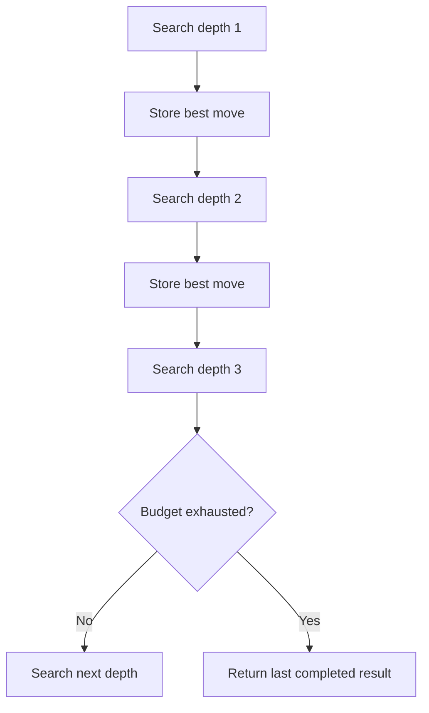

This provides:

- A usable move if time expires
- Better move ordering
- Progressive improvement
- Predictable time management

The engine searches:

$$
1 \rightarrow 2 \rightarrow 3 \rightarrow \cdots \rightarrow d
$$

Even though earlier work is repeated, the improved ordering makes deeper alpha–beta searches much faster.

---

# 8. Evaluation function

When the engine cannot search until checkmate, it estimates the position.

A basic evaluation can be:

$$
E(s)=
w_mM+
w_pP+
w_uU+
w_kK+
w_sS+
w_tT
$$

Where:

- \(M\): material
- \(P\): piece placement
- \(U\): mobility
- \(K\): king safety
- \(S\): pawn structure
- \(T\): additional tactical or positional features
- \(w\): importance assigned to each feature

## Material values

| Piece  | Centipawn value |
| ------ | --------------: |
| Pawn   |             100 |
| Knight |             320 |
| Bishop |             330 |
| Rook   |             500 |
| Queen  |             900 |

A score of \(+100\) means approximately one pawn of advantage.

Example:

```text
White: queen + rook + 5 pawns
Black: queen + bishop + 5 pawns
```

Ignoring everything else:

$$
E=(900+500+500)-(900+330+500)
$$

$$
E=170
$$

White is ahead by approximately 1.7 pawns.

## Evaluation pipeline

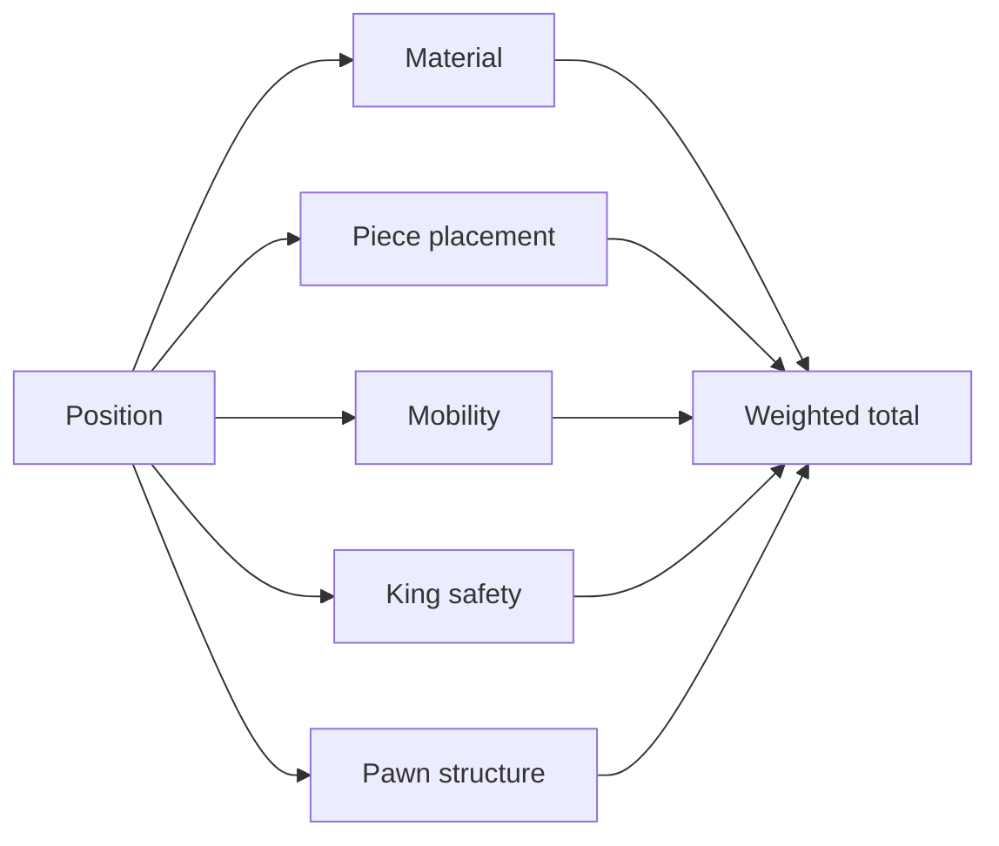

---

# 9. Piece-square tables

Material values do not capture where pieces are placed.

For example, a knight generally performs better near the center:

```text
Poor square:  knight on a1
Good square:  knight on d4
```

The evaluation becomes:

$$
\text{piece score}
=
\text{material value}
+
\text{square bonus}
$$

You can define a 64-element table for each piece.

```go
score += knightValue
score += knightTable[square]
```

Use separate tables for:

- Opening/middlegame
- Endgame
- White and Black, or mirror the squares

---

# 10. Tapered evaluation

Some features change value during the game.

For example:

- King safety is extremely important in the middlegame.
- King activity becomes valuable in the endgame.

Calculate two scores:

$$
E_{mid}
$$

$$
E_{end}
$$

Then interpolate:

$$
E =
\phi E_{mid}
+
(1-\phi)E_{end}
$$

Where:

$$
0 \leq \phi \leq 1
$$

- \(\phi=1\): opening/middlegame
- \(\phi=0\): endgame

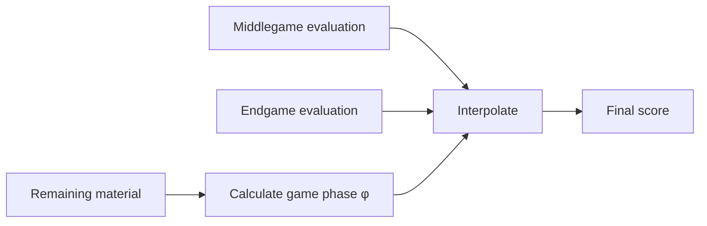

---

# 11. Quiescence search

Suppose the normal search ends here:

```text
White captures Black's queen
```

The evaluation reports that White is winning. But Black may recapture White’s queen on the next move.

This is the **horizon effect**: the search stopped during an unstable tactical sequence.

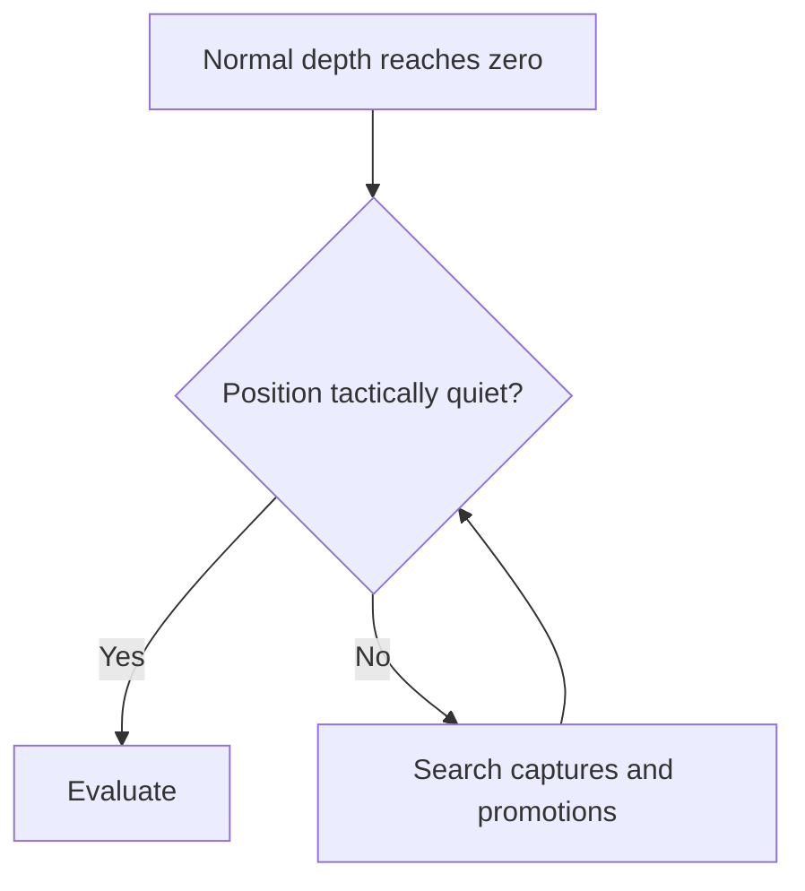

Instead of evaluating immediately at depth zero, search forcing tactical moves:

- Captures
- Promotions
- Sometimes checks

A simplified formula:

$$
Q(s,\alpha,\beta)
=
\max\left(
E(s),
\max_{m\in TacticalMoves(s)}
[-Q(child)]
\right)
$$

Quiescence does not search every quiet move. Otherwise, it would become another full search.

---

# 12. Transposition tables

Different move orders can produce the same position:

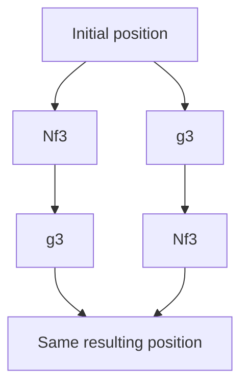

Without caching, the engine searches the same position twice.

A transposition-table entry commonly stores:

```go
type Entry struct {
    Hash     uint64
    Depth    int
    Score    int
    Bound    BoundType
    BestMove Move
}
```

Bound types:

- Exact: true search score
- Lower bound: score is at least this value
- Upper bound: score is at most this value

---

# 13. Zobrist hashing

Zobrist hashing gives positions compact 64-bit identifiers.

Generate random numbers for:

- Every piece type
- Every square
- Side to move
- Castling rights
- En-passant information

The position hash is built using XOR:

$$
H =
K_{piece_1,square_1}
\oplus
K_{piece_2,square_2}
\oplus \cdots
\oplus K_{turn}
\oplus K_{castling}
$$

When a piece moves from `e2` to `e4`:

$$
H' =
H
\oplus K_{pawn,e2}
\oplus K_{pawn,e4}
\oplus K_{turn}
$$

XOR removes the old key and adds the new one.

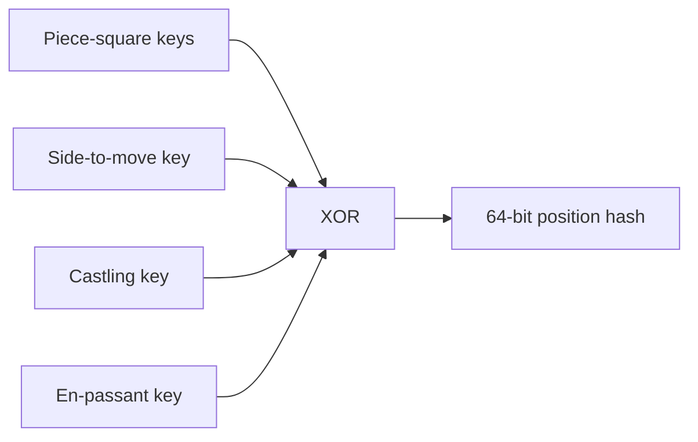

Hash collisions are possible but rare. Store enough identifying information to reduce their risk.

---

# 14. Mate and terminal scores

Terminal states override normal evaluation.

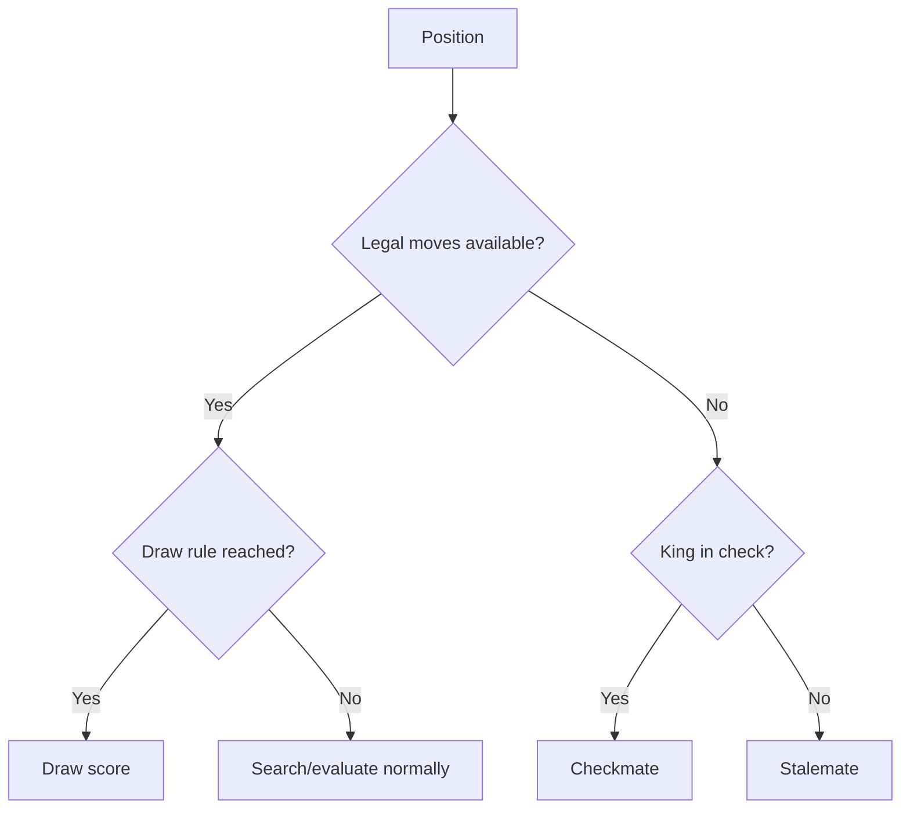

Use a mate value much larger than normal positional scores:

$$
M=1{,}000{,}000
$$

To prefer faster mates:

$$
\text{winning mate score}=M-\text{ply}
$$

To delay unavoidable mate:

$$
\text{losing mate score}=-M+\text{ply}
$$

---

# 15. Controlling bot strength

Different difficulty levels should not rely on only one setting.

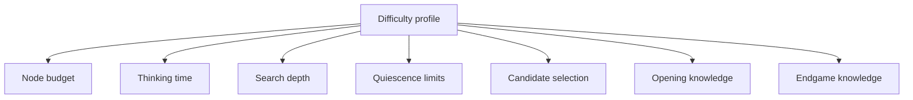

Useful controls include:

- Maximum nodes
- Maximum depth
- Thinking time
- Quiescence depth
- Transposition-table size
- Candidate-move randomness
- Maximum acceptable score loss
- Opening-book knowledge
- Tactical extensions

A node budget is more consistent across machines than time alone.

---

# 16. Probabilistic move selection

Suppose the search produces:

| Move | Score |
| ---- | ----: |
| A    | +0.70 |
| B    | +0.55 |
| C    | +0.20 |
| D    | −0.80 |

A maximum-strength bot always selects A.

A weaker bot can select among reasonable alternatives using softmax:

$$
P(m_i)=
\frac{e^{s_i/T}}
{\sum_j e^{s_j/T}}
$$

Where:

- \(s_i\): candidate score
- \(T\): temperature
- Small \(T\): almost always choose the best move
- Large \(T\): more variation

For numerical stability:

$$
P(m_i)=
\frac{e^{(s_i-s_{best})/T}}
{\sum_j e^{(s_j-s_{best})/T}}
$$

Before sampling, filter catastrophic moves:

$$
s_{best}-s_i \leq L
$$

Where \(L\) is the allowed centipawn loss.

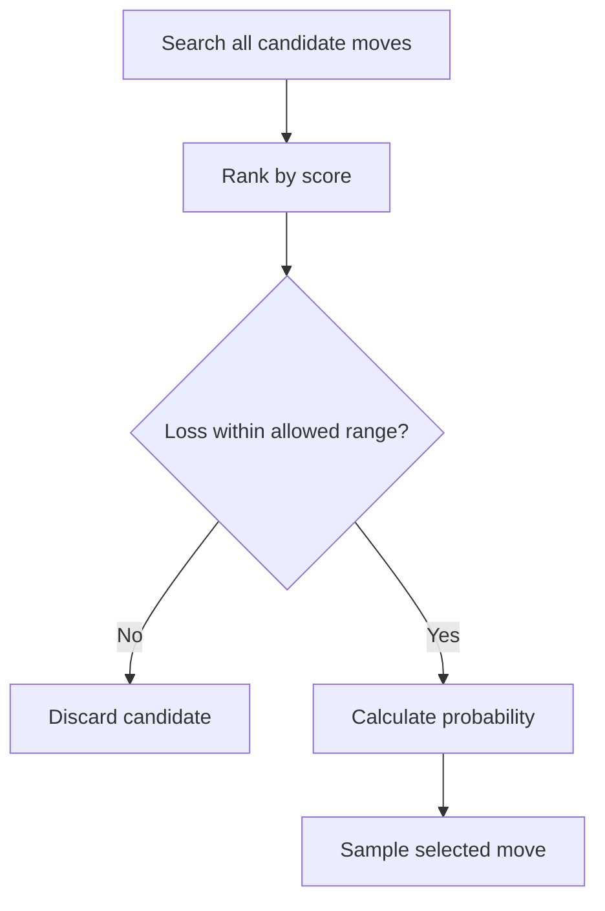

This produces controlled imperfection instead of completely random play.

---

# 17. Modelling mistakes

You can classify a move by centipawn loss:

$$
CPL=s_{best}-s_{played}
$$

Possible approximate categories:

| Centipawn loss | Classification |
| -------------: | -------------- |
|           0–30 | Good move      |
|          30–80 | Inaccuracy     |
|         80–200 | Mistake        |
|           200+ | Blunder        |

These are project-defined thresholds, not universal chess laws.

Mistake probability should depend on the position:

$$
P(error)
=
f(
difficulty,
tacticalComplexity,
forcingMoves,
kingDanger,
remainingTime
)
$$

A weak bot should still usually see:

- A forced legal move
- An obvious recapture
- A simple mate in one

It should struggle more with:

- Long combinations
- Quiet defensive moves
- Backward threats
- Positional sacrifices
- Multiple comparable candidates

---

# 18. Bot personalities

Strength and personality should be separate.

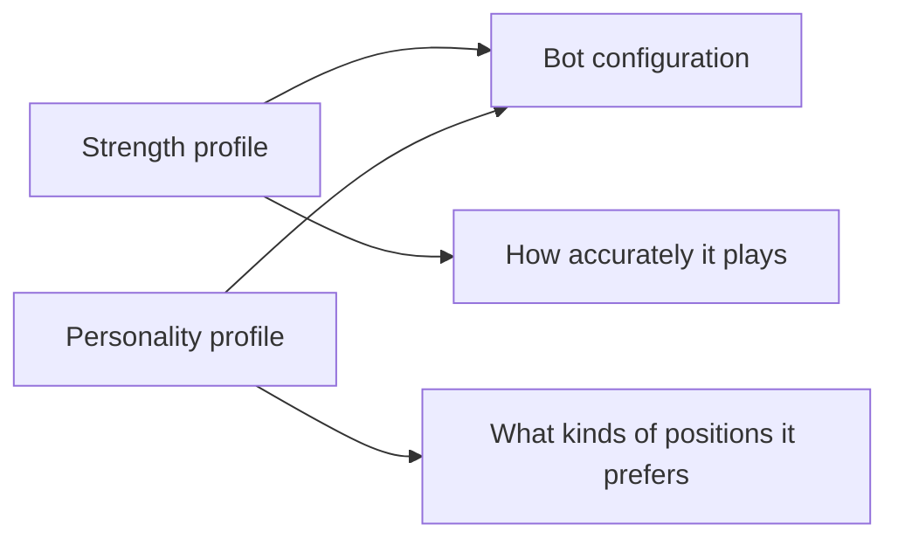

Example evaluation weights:

$$
E =
w_mM+
w_kK+
w_aA+
w_sS+
w_xX
$$

An aggressive bot might use:

$$
E_{aggressive}
=
1.0M+
0.7K+
1.5A+
0.8S+
1.4X
$$

A cautious bot might use:

$$
E_{cautious}
=
1.1M+
1.5K+
0.8A+
1.2S+
0.7X
$$

Possible profiles:

| Personality | Behaviour                                  |
| ----------- | ------------------------------------------ |
| Aggressive  | Attacks the king and accepts complications |
| Cautious    | Prioritizes king safety and structure      |
| Materialist | Avoids sacrifices and values material      |
| Tactician   | Searches forcing moves more deeply         |
| Positional  | Values space, mobility and pawn structure  |
| Simplifier  | Trades pieces when ahead                   |
| Gambler     | Accepts risky, near-equal alternatives     |

Personality changes evaluation and selection preferences. It should not change chess legality.

---

# 19. Elo mathematics

Expected score for player A:

$$
E_A=
\frac{1}
{1+10^{(R_B-R_A)/400}}
$$

Suppose:

$$
R_A=1600,\qquad R_B=1400
$$

Then:

$$
E_A=
\frac{1}
{1+10^{-0.5}}
\approx 0.76
$$

A is expected to score about 76%, counting:

- Win = 1
- Draw = 0.5
- Loss = 0

A simple rating update is:

$$
R'_A=R_A+K(S_A-E_A)
$$

But your bot’s advertised Elo should come from actual matches, not directly from depth.

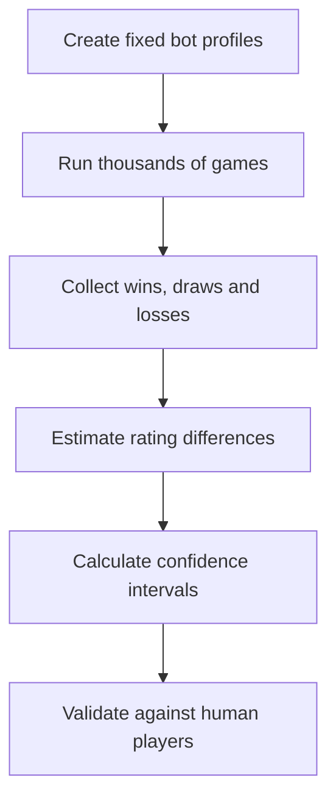

A bot’s Elo depends on:

- Engine version
- Opponent population
- Time control
- Hardware or node limit
- Opening book
- Search implementation
- Evaluation quality
- Rating system

Therefore:

$$
\text{depth 4} \neq \text{universally 1500 Elo}
$$

---

# 20. Complete engine loop

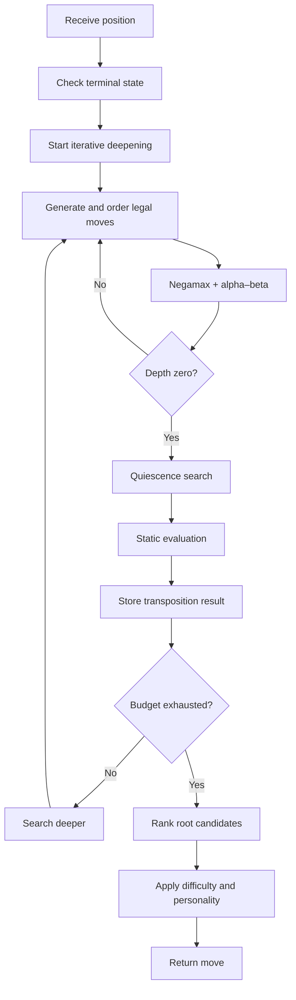

A sensible implementation order is:

1. Correct legal move generation
2. Make/unmake moves
3. Perft testing
4. Static evaluation
5. Negamax
6. Alpha–beta pruning
7. Iterative deepening
8. Move ordering
9. Quiescence search
10. Zobrist hashing
11. Transposition table
12. Difficulty profiles
13. Personality profiles
14. Tournament-based Elo calibration
