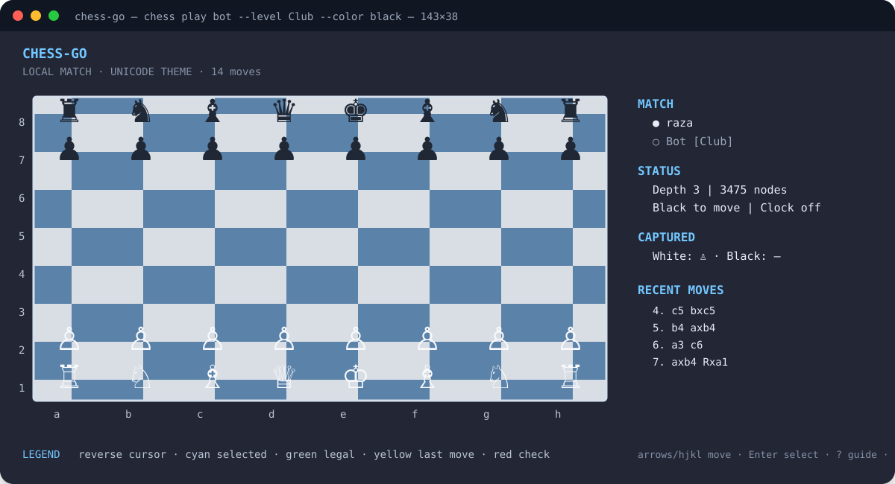
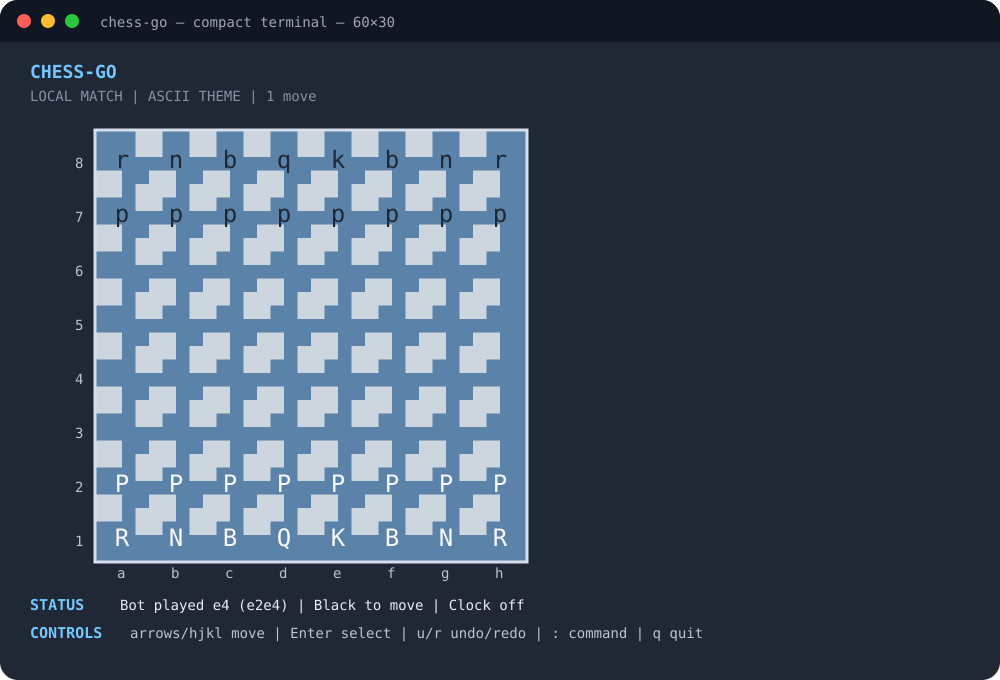

# Command-line reference

The `chess` command is a dependency-light terminal client, bot runner, and
network client. Run it from a checkout with `go run ./cmd/chess ...`, or install
it with `go install ./cmd/chess` and use the resulting `chess` binary.

## Top-level commands

| Command | Purpose |
|---|---|
| `chess help` / `chess --help` | Print the top-level command summary and point to this reference. |
| `chess version` | Print the binary name and build version. |
| `chess play local` | Local human-versus-human game. |
| `chess play bot` | Play against a built-in classical search bot. |
| `chess play remote ADDRESS` | Join or create an authoritative network match. |
| `chess load FILE` | Load a PGN and continue it locally. |
| `chess host` | Run the HTTP/WebSocket match server. |
| `chess join ADDRESS` | Join a remote match as a player or spectator. |
| `chess connect ADDRESS` | Alias for `join`. |
| `chess spectate ADDRESS` | Join a remote match as a spectator. |
| `chess matchmake ADDRESS` | Find a compatible open seat or create a waiting match. |
| `chess list ADDRESS` | List matches exposed by a server. |
| `chess discover` | Discover LAN chess hosts through DNS-SD/mDNS. |

All commands reject unknown positional arguments. Paths, player names, tokens,
addresses, and external engine commands should come from flags or environment
variables rather than being embedded in scripts.

## Interactive launcher

Run `chess` with no arguments, or run `chess menu`, from a terminal to open the
keyboard-driven launcher. It is a menu equivalent of the command-line surface:

| Menu | Covers |
|---|---|
| Local game | `play local`: clock, increment, and theme. |
| Play against bot | `play bot`: level/depth, color, personality, seed, random variation, clock, increment, and theme. |
| Remote game | `play remote`: address, match, player, color, token, create, clocks, and theme. |
| Network tools | `host`, `join`, `connect`, `spectate`, `matchmake`, `list`, and `discover`, including their flags. |
| Load PGN | `load FILE`. |
| Settings | Board theme, scalable piece style, bot randomness/seed, JSON or protobuf wire format, insecure-local mode, and TLS CA/mTLS paths. |
| Help | The top-level command reference. |
| Version | `version`. |

Use Arrow keys or `j`/`k` to move, Enter or Space to select, and `q` or Esc to
go back. Press `-` or type `none` for optional values such as a seed, token,
or TLS path. The Settings screen validates paired mTLS certificate/key paths
before saving them. Environment variables remain the defaults, so the launcher is
convenient without hard-coding identity, paths, or network settings.

## Local play

```console
chess play local [--clock DURATION] [--increment DURATION] [--theme ascii|unicode]
```

- `--clock DURATION` gives each side a clock, for example `10m`, `5m`, or
  `30s`. It defaults to `CHESS_CLOCK`; an empty value disables clocks.
- `--increment DURATION` adds time after a completed move. It defaults to
  `CHESS_INCREMENT` and requires a clock.
- `--theme ascii|unicode` chooses letters or chess glyphs. It defaults to
  `CHESS_THEME`, then `unicode`.

In an interactive terminal, use Arrow keys or `h`/`j`/`k`/`l` to move the
cursor, Enter or Space to select, `Esc` to clear selection, `u`/`r` for
undo/redo, `n` for a confirmed new game, `:` for the command palette, `?` for
the key guide, and `q` or Ctrl-C to quit. Narrow terminals stack the sidebar
below the board; redirected output uses the line renderer.





## Bot play

```console
chess play bot [--level NAME | --depth N] [--color white|black]
               [--personality NAME] [--seed INTEGER] [--random[=BOOL]]
               [--clock DURATION] [--increment DURATION]
               [--theme ascii|unicode]
```

- `--level NAME` selects `Learner`, `Beginner`, `Casual`, `Club`, `Advanced`,
  `Expert`, or `Maximum` (case-insensitive). A named level takes precedence
  over `--depth`.
- `--depth N` sets raw fixed-depth search when no named level is selected;
  values must be positive. Default: `CHESS_BOT_DEPTH`, then `3`.
- `--color white|black` chooses the human side. Default:
  `CHESS_PLAYER_COLOR`, then `white`.
- `--personality NAME` selects `Cautious`, `Aggressive`, `Materialist`,
  `Tactician`, `Positional`, `Simplifier`, or `Trickster`.
- `--seed INTEGER` makes personality selection reproducible. It accepts Go
  integer syntax such as `42` or `0x2a` and is read from `CHESS_BOT_SEED` when
  omitted.
- `--random[=BOOL]` varies among near-best moves using a seeded, weighted
  selector. It defaults to `true` (`CHESS_BOT_RANDOM`) so separate launches
  can play different legal moves while still preferring the search result.
  Use `--random=false` for the historical deterministic best-move behavior.
  Set `--seed` or `CHESS_BOT_SEED` when you want random-looking play that is
  exactly reproducible. Forced moves remain forced; the strongest `Maximum`
  profile can also remain deterministic because it accepts no evaluation loss.
- `--clock`, `--increment`, and `--theme` use the same defaults as local play.

The dashboard displays the bot's latest completed depth, node count, and score
when the built-in engine returns search statistics.

## Remote play

```console
chess play remote ADDRESS --match ID [--player ID]
                       [--color white|black|spectator] [--token TOKEN]
                       [--create] [--clock-millis N] [--increment-millis N]
                       [--theme ascii|unicode]
```

- `ADDRESS` must include `http://` or `https://` and a host.
- `--match ID` is required unless supplied by `CHESS_MATCH_ID`.
- `--player ID` defaults to `CHESS_PLAYER_ID`, then `CHESS_PLAYER_NAME`, then
  the operating-system `USER` value.
- `--color` defaults to `CHESS_PLAYER_COLOR`, then `white`; `spectator` cannot
  submit moves.
- `--token` defaults to `CHESS_NETWORK_TOKEN` and sends `Authorization: Bearer`.
- `--create` creates the match instead of joining an existing match.
- `--clock-millis` and `--increment-millis` apply only when creating a match.
- `--theme` defaults to `CHESS_THEME`, then `unicode`.

Remote line commands are `help` or an empty line (redisplay), a UCI move such
as `e2e4`, `refresh`/`sync`, `draw`, `resign`, and `quit`/`exit`. The server is
authoritative: the client sends an intention and rebuilds its board from the
returned snapshot.

The related one-shot commands use these forms:

```console
chess join ADDRESS --match ID [--player ID] [--color white|black|spectator] [--token TOKEN]
chess connect ADDRESS --match ID [--player ID] [--color white|black|spectator] [--token TOKEN]
chess spectate ADDRESS --match ID [--player ID] [--token TOKEN]
chess list ADDRESS [--token TOKEN]
chess matchmake ADDRESS [--player ID] [--color white|black|random] [--token TOKEN]
                       [--clock-millis N] [--increment-millis N]
```

`connect` is an alias for `join`; `spectate` forces the spectator role. The
one-shot commands print the match ID, sequence, FEN, result, and available
clock fields.

## Hosting and LAN discovery

```console
chess host [--addr ADDRESS] [--token TOKEN]
           [--cert FILE --key FILE] [--insecure] [--store FILE] [--lan] [--lan-instance NAME]
chess discover [--seconds N]
```

`host` flags default to `CHESS_NETWORK_ADDR`/`:8080`,
`CHESS_NETWORK_TOKEN`, `CHESS_TLS_CERT`, `CHESS_TLS_KEY`, and
`CHESS_MATCH_STORE`. `--lan` defaults to `CHESS_LAN_DISCOVERY`; its service
name defaults to `CHESS_LAN_INSTANCE`/`chess-go`, and the advertised hostname
can be set with `CHESS_LAN_HOST`. TLS certificate and key must be supplied
together. TLS is required unless `--insecure` (or
`CHESS_NETWORK_INSECURE=true`) is explicitly selected for local development.
The minimum TLS version is 1.3. `CHESS_TLS_CA` adds a private CA, while
`CHESS_TLS_CLIENT_CERT` and `CHESS_TLS_CLIENT_KEY` configure a client
certificate. A non-positive `--seconds` is rejected by `discover`.

The server exposes `POST /v1/messages`, `GET /v1/matches`,
`GET /v1/matches/{id}`, and WebSocket upgrades at `/ws`. Add a token and TLS
before exposing a server beyond a trusted local network.

## Line-mode commands

When stdin or stdout is redirected, local play accepts SAN (`Nf3`, `O-O`) or
UCI (`g1f3`) moves and the following commands:

| Input | Effect |
|---|---|
| `moves` | Print every legal move as SAN with its UCI coordinate. |
| `undo` | Move one ply back, or one complete human/bot turn. |
| `redo` | Restore one previously undone ply/turn. |
| `fen FEN` | Replace the game with a validated six-field FEN. |
| `load FILE` | Replace the game with a parsed PGN file. |
| `save FILE` | Write the current game as PGN. |
| `theme ascii` / `theme unicode` | Change board rendering. `theme` alone reports the current theme. |
| `flip` | Toggle board orientation. |
| `draw` | End the local game by agreement. |
| `claim draw` | Claim a FIDE 50-move or threefold draw when eligible. |
| `resign` | End the local game for the side to move. |
| `help` | Print the move and command summary. |
| `quit`, `exit`, `q` | End the session. |

Commands that change a finished game are rejected. `fen`, `load`, `save`, and
`theme` take one argument; file paths are interpreted by the current process.

## Environment variables

| Variable | Used by |
|---|---|
| `CHESS_THEME` | Default `unicode`/`ascii` board theme. |
| `CHESS_PIECE_STYLE` | Unicode piece presentation: `auto` (default scalable icons when cells support them), `text`, `sprite`/`icon`, or `emoji`. |
| `CHESS_PLAYER_NAME` | Human/player identity. |
| `CHESS_PLAYER_COLOR` | Human or remote color. |
| `CHESS_BOT_NAME` | Local bot display name. |
| `CHESS_BOT_DEPTH` | Raw bot depth. |
| `CHESS_BOT_LEVEL` | Named bot strength profile. |
| `CHESS_BOT_PERSONALITY` | Bot style. |
| `CHESS_BOT_SEED` | Move-selection seed for reproducible bot play. |
| `CHESS_BOT_RANDOM` | Enable near-best move variation (default `true`). |
| `CHESS_CLOCK` / `CHESS_INCREMENT` | Local time control. |
| `CHESS_NETWORK_ADDR` | Host server bind address. |
| `CHESS_NETWORK_TOKEN` | HTTP/WebSocket bearer token. |
| `CHESS_NETWORK_FORMAT` | Envelope framing for environment-backed clients: `json` (default) or `protobuf`. |
| `CHESS_MATCH_ID` / `CHESS_PLAYER_ID` | Remote match/session defaults. |
| `CHESS_TLS_CERT` / `CHESS_TLS_KEY` | Host TLS files. |
| `CHESS_TLS_CA` | Additional CA certificate bundle for HTTPS clients. |
| `CHESS_TLS_CLIENT_CERT` / `CHESS_TLS_CLIENT_KEY` | Optional mTLS client certificate and key. |
| `CHESS_NETWORK_INSECURE` | Permit plaintext host mode for isolated local development (default `false`). |
| `CHESS_MATCH_STORE` | Durable host state JSON path. |
| `CHESS_LAN_DISCOVERY` / `CHESS_LAN_INSTANCE` / `CHESS_LAN_HOST` | LAN advertising. |
| `NO_COLOR` | Disable ANSI SGR color on terminal output. |

## Other binaries

```console
go run ./cmd/perft --depth 4
go run ./cmd/perft --fen "7k/7p/8/8/8/8/P7/K7 b - - 0 1" --depth 2 --divide
go run ./cmd/tournament --profiles Learner,Club,Expert --games 20 --plies 300
```

`perft --help` documents `--fen FEN` (default: the standard initial FEN),
`--depth N` (default: `4`; negative values are rejected), and `--divide`
(print one line per legal root move plus a total). `tournament --help` lists
all of its options: `--profiles`, optional external UCI settings (`--uci`,
`--uci-name`, `--uci-depth`), `--games`, `--plies`, deterministic `--seed`,
metadata fields (`--engine-version`, `--node-budget`, `--time-control`,
`--hardware-class`), and report outputs (`--pgn`, `--json`). Tournament
defaults can also come from `CHESS_TOURNAMENT_PROFILES`,
`CHESS_TOURNAMENT_GAMES`, `CHESS_TOURNAMENT_PLIES`, `CHESS_TOURNAMENT_SEED`,
`CHESS_UCI_ENGINE`, `CHESS_UCI_NAME`, `CHESS_UCI_DEPTH`,
`CHESS_ENGINE_VERSION`, `CHESS_TOURNAMENT_NODE_BUDGET`,
`CHESS_TOURNAMENT_TIME_CONTROL`, and `CHESS_TOURNAMENT_HARDWARE`.

See [`examples/README.md`](../examples/README.md) for 55 copy-pasteable API
programs and [`docs/api.md`](api.md) for library-level usage.
