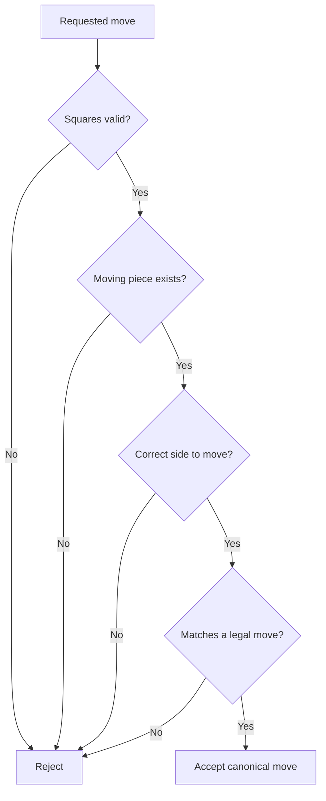
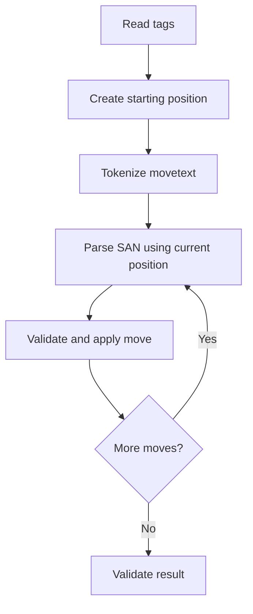
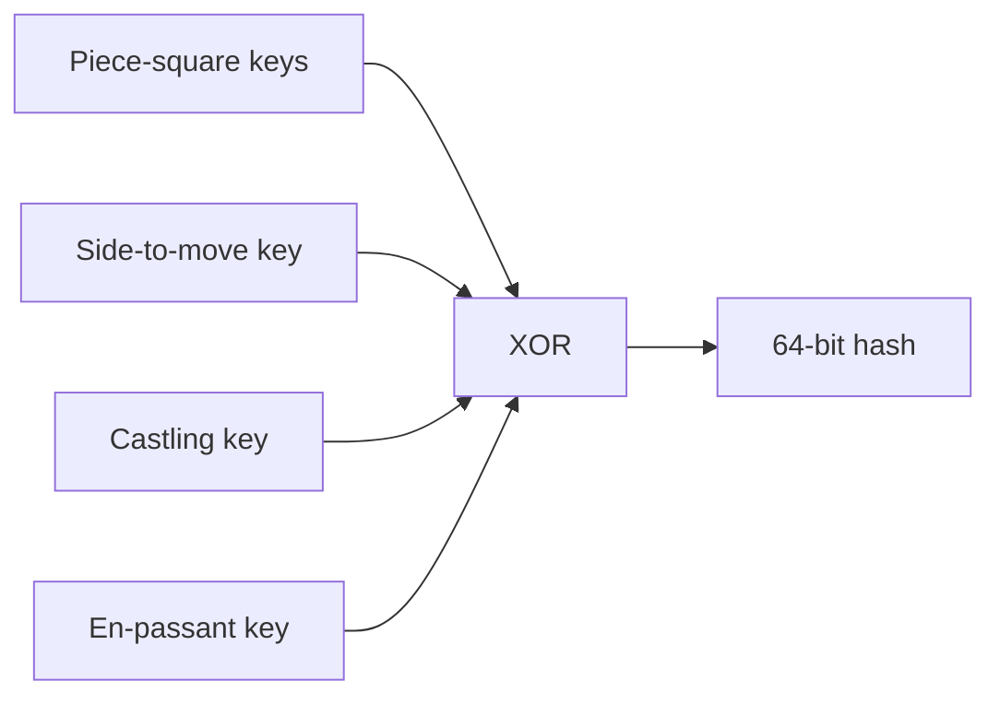
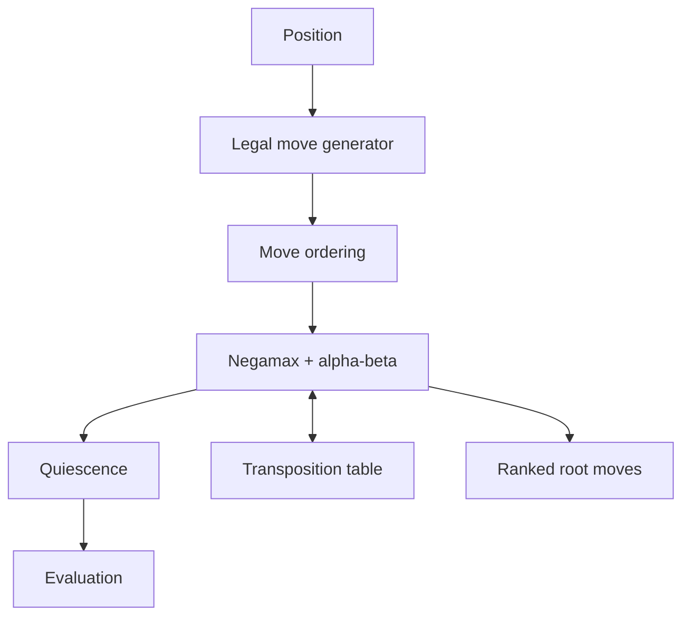
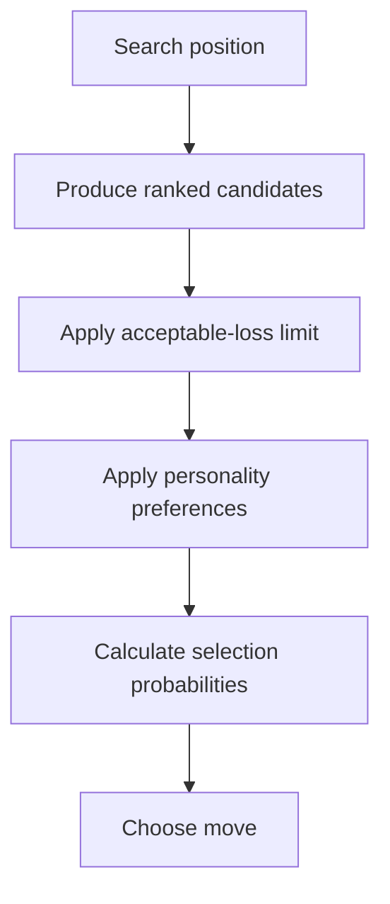
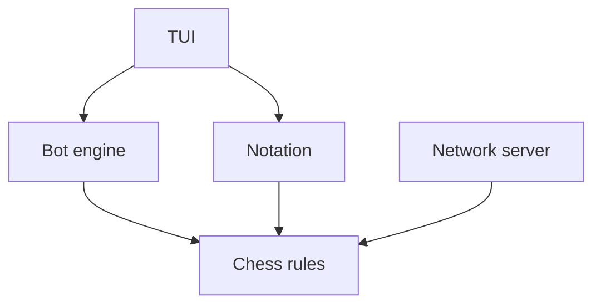

These responsibilities together form the boundary of your `chess-core-go` repository. The library should know everything about chess rules and position state, but nothing about terminal rendering or networking.

# 1. Board representation

Board representation defines how a chess position exists in memory.

A complete position contains more than the 64 visible squares:

```go
type Position struct {
    Board          Board
    SideToMove     Color
    CastlingRights CastlingRights
    EnPassant      Square
    HalfmoveClock  int
    FullmoveNumber int
}
```

It must represent:

* Which piece occupies each square
* Which side moves next
* Available castling rights
* En-passant state
* Halfmove clock
* Fullmove number
* Often a position hash
* Possibly king locations for faster check detection

## Square representation

Number squares from `0` through `63`:

```text
a1 = 0
b1 = 1
...
h1 = 7
a2 = 8
...
h8 = 63
```

Conversions:

$$
square = rank \times 8 + file
$$

$$
file = square \bmod 8
$$

$$
rank = \left\lfloor\frac{square}{8}\right\rfloor
$$

```go
type Square uint8

func NewSquare(file, rank int) Square {
    return Square(rank*8 + file)
}
```

## Representation options

### 64-element array

```go
type Board [64]Piece
```

Advantages:

* Easy to understand
* Easy to debug
* Good for the first implementation
* Directly answers which piece occupies a square

Disadvantages:

* Move generation may be slower
* Detecting all pieces of one type requires scanning

### Bitboards

A bitboard is a 64-bit integer where each bit represents one square:

```go
type Bitboard uint64
```

For example, one bitboard can represent all White pawns:

```text
00000000
00000000
00000000
00000000
00000000
11111111
00000000
00000000
```

Set a square:

$$
B' = B \;|\; (1 \ll square)
$$

Clear a square:

$$
B' = B \;\&\; \neg(1 \ll square)
$$

Test a square:

$$
occupied = (B \;\&\; (1 \ll square)) \neq 0
$$

Typical structure:

```go
type Position struct {
    Pieces [2][6]Bitboard
    OccupiedByColor [2]Bitboard
    Occupied Bitboard
}
```

Advantages:

* Very fast attack and move calculations
* One CPU value represents many squares
* Common in high-performance chess engines

Disadvantages:

* More difficult to implement and debug
* Sliding attacks require additional techniques
* Easy to introduce subtle bit-manipulation errors

For your first version, a board array is perfectly reasonable. You can later add bitboards internally without changing the public API.

---

# 2. Piece placement

Piece placement answers:

> Which piece, if any, is on a particular square?

A piece contains:

* Color
* Piece type

```go
type Color uint8

const (
    White Color = iota
    Black
)

type PieceType uint8

const (
    NoPieceType PieceType = iota
    Pawn
    Knight
    Bishop
    Rook
    Queen
    King
)

type Piece struct {
    Type  PieceType
    Color Color
}
```

You need operations such as:

```go
func (b *Board) PieceAt(square Square) Piece
func (b *Board) Place(square Square, piece Piece)
func (b *Board) Remove(square Square)
func (b *Board) Move(from, to Square)
```

Piece placement must remain synchronized with any secondary data:

* King square cache
* Bitboards
* Occupancy masks
* Material counts
* Position hash

If a rook moves from `a1` to `a4`, updating only the `[64]Piece` board while forgetting its bitboard will corrupt the position.

The cleanest approach is to make board mutation private and expose only controlled `MakeMove` and `UnmakeMove` operations.

---

# 3. Pseudo-legal and legal move generation

## Pseudo-legal moves

A pseudo-legal move follows the piece’s movement rules but may leave its own king in check.

Examples:

* A bishop moves diagonally without jumping.
* A rook moves horizontally or vertically.
* A pawn captures diagonally.
* A knight jumps using its L-shaped pattern.

Suppose a rook is shielding its king from an enemy rook. Moving the rook away follows the rook’s movement rules but exposes the king.

That move is pseudo-legal but not legal.

## Legal moves

A legal move:

1. Is pseudo-legal.
2. Does not leave the moving side’s king in check.
3. Satisfies special restrictions such as castling through check.

The common implementation is:

```go
func LegalMoves(pos *Position) []Move {
    candidates := GeneratePseudoLegalMoves(pos)
    legal := make([]Move, 0, len(candidates))

    for _, move := range candidates {
        undo := pos.MakeMove(move)

        if !pos.IsKingInCheck(move.Side()) {
            legal = append(legal, move)
        }

        pos.UnmakeMove(move, undo)
    }

    return legal
}
```

## Why separate them?

Generating pseudo-legal moves is comparatively simple. Legality is then checked using the shared make/unmake machinery.

Later, you can optimize:

* Pinned pieces
* Check evasion
* Double-check handling
* King attack masks

But initially, correctness matters more than avoiding make/unmake calls.

## Piece move generation

### Pawn

Depends on:

* Color
* Empty forward square
* Starting rank
* Diagonal enemy pieces
* Promotion rank
* En-passant square

### Knight

Has at most eight possible destinations. It ignores intervening pieces.

### Bishop

Moves along four diagonals until:

* Board edge
* Friendly piece
* Enemy piece, which can be captured

### Rook

Moves along four horizontal/vertical directions.

### Queen

Combines bishop and rook movement.

### King

Moves one square in each direction, plus castling. Its destination cannot be attacked.

---

# 4. Move validation

Move generation asks:

> What can be played from this position?

Move validation asks:

> Is this particular requested move allowed?

This matters when receiving moves from:

* TUI input
* Network clients
* PGN files
* SAN parsers
* Bot engines

Never trust an online client to validate its own move.

A validation pipeline can be:



The safest implementation is to generate legal moves and find an exact match:

```go
func ValidateMove(pos *Position, requested Move) (Move, error) {
    for _, legal := range pos.LegalMoves() {
        if legal.Matches(requested) {
            return legal, nil
        }
    }

    return Move{}, ErrIllegalMove
}
```

Return the canonical generated move because it can contain internal flags the caller omitted:

* Capture
* En passant
* Castling
* Promotion
* Double pawn push

---

# 5. Apply and undo moves

The bot may make and undo millions of moves during search. Copying the complete position at every node is simple but expensive.

## Applying a move

A normal move may update:

* Source square
* Destination square
* Captured piece
* Side to move
* Castling rights
* En-passant square
* Halfmove clock
* Fullmove number
* Position hash
* Repetition history
* King location
* Evaluation caches

Special moves update even more.

## Undo information

Store everything required to restore the exact previous position:

```go
type Undo struct {
    CapturedPiece       Piece
    PreviousCastling    CastlingRights
    PreviousEnPassant   Square
    PreviousHalfmove    int
    PreviousHash        uint64
    PreviousKingSquares [2]Square
}
```

Usage:

```go
undo := position.MakeMove(move)
score := search(position, depth-1)
position.UnmakeMove(move, undo)
```

The critical invariant is:

$$
Unmake(Make(P,m))=P
$$

Not merely the same visible board—the entire state must be identical.

Test this explicitly:

```go
before := position.Clone()

undo := position.MakeMove(move)
position.UnmakeMove(move, undo)

if position != before {
    t.Fatal("make/unmake corrupted position")
}
```

Do not reconstruct previous castling or en-passant information by guessing. Save it in the undo record.

---

# 6. Check, checkmate and stalemate

## Check

A king is in check when its square is attacked by an enemy piece.

```go
func IsInCheck(pos Position, side Color) bool {
    kingSquare := pos.KingSquare(side)
    return pos.IsSquareAttacked(kingSquare, side.Opponent())
}
```

Attack detection should handle:

* Pawn attacks
* Knight attacks
* Sliding bishop/queen attacks
* Sliding rook/queen attacks
* Adjacent enemy king

Notice that pawn attacks differ from pawn movement. A pawn attacks diagonally even if those squares are empty.

## Checkmate

Checkmate occurs when:

$$
KingInCheck \land LegalMoves=0
$$

```go
if pos.IsInCheck(pos.SideToMove) &&
   len(pos.LegalMoves()) == 0 {
    return Checkmate
}
```

The side to move loses.

## Stalemate

Stalemate occurs when:

$$
\neg KingInCheck \land LegalMoves=0
$$

It is a draw.

```go
if !pos.IsInCheck(pos.SideToMove) &&
   len(pos.LegalMoves()) == 0 {
    return Stalemate
}
```

Checkmate and stalemate therefore differ only by whether the king is currently attacked.

---

# 7. Castling

Castling moves the king and rook in one move.

Standard chess requirements:

* King has not previously moved.
* Relevant rook has not previously moved.
* Required squares between them are empty.
* King is not currently in check.
* King does not cross an attacked square.
* King does not finish on an attacked square.

For White kingside castling:

```text
Before: King e1, rook h1
After:  King g1, rook f1
```

You must store castling rights explicitly:

```go
type CastlingRights uint8

const (
    WhiteKingSide CastlingRights = 1 << iota
    WhiteQueenSide
    BlackKingSide
    BlackQueenSide
)
```

You cannot infer rights from piece locations. A king could move away and return to `e1`; it still cannot castle.

Rights are removed when:

* A king moves
* A rook moves from its original square
* A rook is captured on its original square

The last condition is easy to overlook.

---

# 8. Promotion

A pawn reaching the final rank must promote.

White promotes on rank 8. Black promotes on rank 1.

It can promote to:

* Queen
* Rook
* Bishop
* Knight

Not to:

* King
* Pawn

Queen promotion is common, but underpromotion can be strategically necessary.

Your move representation must include the target piece:

```go
type Move struct {
    From      Square
    To        Square
    Promotion PieceType
    Flags     MoveFlags
}
```

Examples:

```text
UCI: e7e8q
SAN: e8=Q
SAN capture: exd8=N
```

During application:

1. Remove the pawn.
2. Place the promoted piece.
3. Apply capture if present.
4. Reset the halfmove clock.
5. Update the hash and material state.

---

# 9. En passant

If a pawn advances two squares, an adjacent enemy pawn may capture it as if it had moved only one square.

Example:

```text
White pawn: e5
Black plays: d7-d5
White may play: exd6 en passant
```

The White pawn moves to `d6`, but the captured Black pawn is removed from `d5`.

This opportunity exists only on the immediately following move.

Store an en-passant target square:

```go
EnPassant Square
```

After `d7-d5`, the target is `d6`.

During en-passant application:

* The destination was empty.
* The captured pawn is behind the destination.
* Removing that pawn may expose a rook or bishop attack on the king.

Therefore en passant must undergo full king-safety validation.

---

# 10. Fifty-move rule

The halfmove clock counts consecutive halfmoves since the most recent:

* Pawn move
* Capture

It resets to zero after either event:

```go
if movingPiece.Type == Pawn || move.IsCapture() {
    pos.HalfmoveClock = 0
} else {
    pos.HalfmoveClock++
}
```

Fifty moves by each player means:

$$
50 \times 2=100\text{ halfmoves}
$$

At 100 halfmoves, a player may claim a draw under the fifty-move rule.

Important distinction:

* The fifty-move rule is normally claim-based.
* Modern FIDE rules also contain an automatic 75-move termination after 150 halfmoves, unless the final move produces checkmate.

Your API can distinguish:

```go
type DrawReason uint8

const (
    DrawClaimFiftyMove DrawReason = iota
    DrawAutomaticSeventyFiveMove
)
```

This distinction matters for a rules-accurate server.

---

# 11. Threefold repetition

A player may claim a draw when the same position occurs for the third time.

“Same position” means more than identical piece placement. It also requires:

* Same side to move
* Same castling possibilities
* Same relevant en-passant possibility
* Same possible moves in rule terms

Therefore, these may look identical but be different:

```text
Position A: White can castle
Position B: White's king previously moved and cannot castle
```

Maintain repetition hashes for the current game history:

```go
type Game struct {
    Position Position
    History  []uint64
    Counts   map[uint64]int
}
```

After each actual game move:

```go
game.Counts[position.RepetitionHash()]++
```

At count 3:

```go
if game.Counts[hash] >= 3 {
    return DrawClaimAvailable
}
```

FIDE rules also recognize automatic draw after fivefold repetition. Model claimable and automatic outcomes separately.

Search moves should not permanently modify the actual game’s repetition record. Either use a search-local history stack or make/unmake repetition changes carefully.

---

# 12. Insufficient material and dead positions

A game is drawn if neither side can possibly produce checkmate through any legal sequence.

Common clearly drawn cases include:

* King versus king
* King and bishop versus king
* King and knight versus king

Some bishop-only endings are also dead when the structure makes mate impossible.

Be careful with rules such as:

> “King and two knights versus king is always automatically insufficient.”

Two knights cannot force mate against a lone king, but “cannot force mate” is not identical to “mate is impossible under every legal continuation.” Automatic dead-position detection is stricter.

A conservative implementation can safely recognize well-established simple cases first:

```go
func IsInsufficientMaterial(pos Position) bool {
    if pos.HasPawnRookOrQueen() {
        return false
    }

    // Recognize only cases proven to be dead.
    // Expand carefully with tested material configurations.
}
```

Avoid declaring a draw merely because checkmate is unlikely or cannot be forced.

The broader FIDE concept is a **dead position**, which can also arise because of blocked structures—not only low material. Complete detection is considerably harder than checking piece counts.

---

# 13. FEN parsing and generation

FEN, or Forsyth–Edwards Notation, represents one position.

Example:

```text
rnbqkbnr/pppppppp/8/8/8/8/PPPPPPPP/RNBQKBNR w KQkq - 0 1
```

It contains six fields:

| Field           | Example        | Meaning                             |
| --------------- | -------------- | ----------------------------------- |
| Placement       | `rnbqkbnr/...` | Pieces on all ranks                 |
| Active color    | `w`            | Side to move                        |
| Castling        | `KQkq`         | Available castling rights           |
| En passant      | `-`            | Target square or none               |
| Halfmove clock  | `0`            | For move-count draw rules           |
| Fullmove number | `1`            | Starts at 1; increments after Black |

## Piece placement symbols

| Symbol | Piece            |
| ------ | ---------------- |
| `P/p`  | White/Black pawn |
| `N/n`  | Knight           |
| `B/b`  | Bishop           |
| `R/r`  | Rook             |
| `Q/q`  | Queen            |
| `K/k`  | King             |

Digits represent consecutive empty squares.

For example:

```text
3k4
```

means:

```text
3 empty, black king, 4 empty
```

## Parser validation

Validate:

* Exactly six fields
* Exactly eight ranks
* Each rank expands to eight squares
* Known piece symbols only
* Active color is `w` or `b`
* Castling field has valid symbols
* En-passant field is `-` or a square
* Numeric fields are valid
* Exactly one king per side for playable positions

It can be useful to distinguish:

* Syntactically valid FEN
* Structurally valid position
* Legally reachable position

A FEN can be syntactically correct yet describe an impossible game history.

---

# 14. SAN notation

SAN, or Standard Algebraic Notation, is human-readable.

Examples:

```text
e4
Nf3
Bxe6
O-O
O-O-O
e8=Q
Qh7+
Qh7#
```

SAN may encode:

* Piece type
* Origin disambiguation
* Capture
* Destination
* Promotion
* Check
* Checkmate
* Castling

## Disambiguation

Suppose two knights can move to `d2`.

You may need:

```text
Nbd2
```

or:

```text
N1d2
```

or, rarely:

```text
Nb1d2
```

The parser must determine the move using the current position.

The safest SAN generation procedure is:

1. Start from a known legal move.
2. Determine whether another same-type piece can reach the destination.
3. Add file/rank disambiguation if required.
4. Apply the move temporarily.
5. Determine whether it produces check or checkmate.
6. Append `+` or `#`.
7. Undo the move.

SAN cannot generally be interpreted without the current position.

---

# 15. UCI move notation

UCI notation is simple coordinate notation:

```text
e2e4
g1f3
e7e8q
```

Structure:

```text
from-square + to-square + optional-promotion
```

It normally does not explicitly say:

* Capture
* Check
* Checkmate
* En passant
* Piece type

Those facts are derived from the current position.

Comparison:

| Property            | SAN         | UCI                         |
| ------------------- | ----------- | --------------------------- |
| Example             | `Nxf7+`     | `e5f7`                      |
| Human-friendly      | Yes         | Less                        |
| Easy to parse       | Harder      | Yes                         |
| Includes check      | Yes         | No                          |
| Requires position   | Yes         | Still needed for validation |
| Engine protocol use | Less common | Standard                    |

Internally, parse UCI into a move request and match it against generated legal moves.

---

# 16. PGN reading and writing

PGN represents an entire game rather than one position.

Example:

```pgn
[Event "Friendly Match"]
[Site "Lahore"]
[Date "2026.09.03"]
[Round "1"]
[White "Raza"]
[Black "Bot"]
[Result "1-0"]

1. e4 e5 2. Nf3 Nc6 3. Bb5 a6 4. Ba4 Nf6 1-0
```

A PGN contains:

## Tag pairs

Metadata such as:

* Event
* Site
* Date
* Round
* White
* Black
* Result
* FEN and SetUp for non-standard initial positions

## Movetext

Contains:

* Move numbers
* SAN moves
* Result
* Comments
* Variations
* Numeric annotation glyphs

Examples:

```pgn
1. e4 {Controls the center} e5
2. Nf3 $1 Nc6
3. Bb5 (3. Bc4 Nf6) a6
```

Important structures:

```go
type PGNGame struct {
    Tags       map[string]string
    Moves      []MoveNode
    Result     Result
}

type MoveNode struct {
    SAN        string
    Move       Move
    Comments   []string
    NAGs       []int
    Variations [][]MoveNode
}
```

For a first version, support:

1. Required tags
2. Main-line SAN
3. Results
4. Comments

Add recursive variations and annotations later.

## Reading process



Never parse all SAN moves independently because every move depends on the position created by previous moves.

---

# 17. Position hashing

Position hashing assigns a compact value to a position:

```go
Hash uint64
```

Its main uses are:

* Transposition-table lookup
* Repetition detection
* Detecting client/server desynchronization
* Caching evaluations
* Comparing positions quickly

Zobrist hashing is the standard approach.



## Incremental updates

When `e2e4` is played:

```go
hash ^= key[WhitePawn][E2]
hash ^= key[WhitePawn][E4]
hash ^= sideToMoveKey
```

Also update:

* Captured piece key
* Castling-right key
* Old/new en-passant key
* Promotion piece key
* Rook squares during castling

## Different hashing purposes

You may eventually want two related concepts:

### Search hash

Identifies the state relevant to continuing the game:

* Pieces
* Side to move
* Castling rights
* En-passant state

### Repetition identity

Must follow the precise repetition rules, especially whether an en-passant right changes the set of legally available moves.

The halfmove and fullmove counters are normally not part of basic transposition identity, though draw-aware search may need the halfmove clock separately.

A hash collision means two different positions produce the same 64-bit value. It is rare but possible. The program must treat hashes as extremely strong identifiers, not mathematical proof of equality.

---

# 18. Bot engine

The bot engine selects a move from a legal position.

It should depend on the rules package, but the rules package should not depend on one specific engine implementation.

```go
type Engine interface {
    Search(
        ctx context.Context,
        position Position,
        limits SearchLimits,
    ) SearchResult
}
```

Possible output:

```go
type SearchResult struct {
    BestMove       Move
    Score          Score
    Depth          int
    Nodes          uint64
    PrincipalLine  []Move
    CandidateMoves []Candidate
}
```

The principal variation is the engine’s predicted best sequence:

```text
1. Nf3 Nc6 2. Bb5 a6 3. Ba4
```

## Engine components



The engine requires:

* Search algorithm
* Evaluation function
* Move ordering
* Time/node management
* Transposition table
* Cancellation support
* Search statistics
* Candidate move ranking

Use `context.Context` so the TUI or server can stop a search:

```go
ctx, cancel := context.WithTimeout(
    context.Background(),
    2*time.Second,
)
defer cancel()
```

Search should operate on a private position copy. It must not mutate the actual game state.

---

# 19. Bot profiles

A profile determines how the engine behaves.

Separate strength from personality:

```go
type BotProfile struct {
    Name        string
    Strength    StrengthProfile
    Personality PersonalityProfile
}
```

## Strength profile

Controls how accurately the bot plays:

```go
type StrengthProfile struct {
    MaxDepth         int
    MaxNodes         uint64
    MoveTime         time.Duration
    QuiescenceDepth  int
    CandidateLoss    int
    Temperature      float64
    BlunderChance    float64
    OpeningKnowledge int
}
```

Relevant controls:

* Search depth
* Node budget
* Thinking time
* Candidate score-loss ceiling
* Move-selection temperature
* Tactical extensions
* Opening-book depth
* Endgame knowledge
* Frequency and severity of mistakes

## Personality profile

Controls what it prefers:

```go
type PersonalityProfile struct {
    Material       float64
    KingSafety     float64
    Mobility       float64
    PawnStructure  float64
    Aggression     float64
    Simplification float64
    SacrificeBias  float64
}
```

Example profiles:

```go
Aggressive := PersonalityProfile{
    Material:       1.0,
    KingSafety:     0.8,
    Mobility:       1.3,
    PawnStructure:  0.8,
    Aggression:     1.5,
    Simplification: 0.5,
    SacrificeBias:  1.4,
}
```

```go
Cautious := PersonalityProfile{
    Material:       1.1,
    KingSafety:     1.5,
    Mobility:       0.9,
    PawnStructure:  1.2,
    Aggression:     0.7,
    Simplification: 1.2,
    SacrificeBias:  0.4,
}
```

## Final selection



Strongest mode:

```text
Always select highest-scoring move.
```

Weaker mode:

```text
Select probabilistically among reasonable candidates.
```

Avoid simply selecting a completely random legal move. That makes the bot weak but not believable.

---

# Recommended internal architecture

```text
chess-core-go/
├── chess/
│   ├── board.go
│   ├── piece.go
│   ├── square.go
│   ├── move.go
│   ├── position.go
│   ├── movegen.go
│   ├── attacks.go
│   ├── make_move.go
│   ├── status.go
│   └── repetition.go
├── notation/
│   ├── fen.go
│   ├── san.go
│   ├── uci.go
│   └── pgn.go
├── engine/
│   ├── search.go
│   ├── negamax.go
│   ├── quiescence.go
│   ├── evaluation.go
│   ├── ordering.go
│   ├── transposition.go
│   └── profile.go
└── perft/
    └── perft.go
```

The dependency direction should be:



The rules layer should not import:

* TUI code
* Networking
* Database code
* A specific bot
* Rendering code

That separation will let the same Go library support local games, bots, servers, tests, PGN tools, and future graphical clients.
